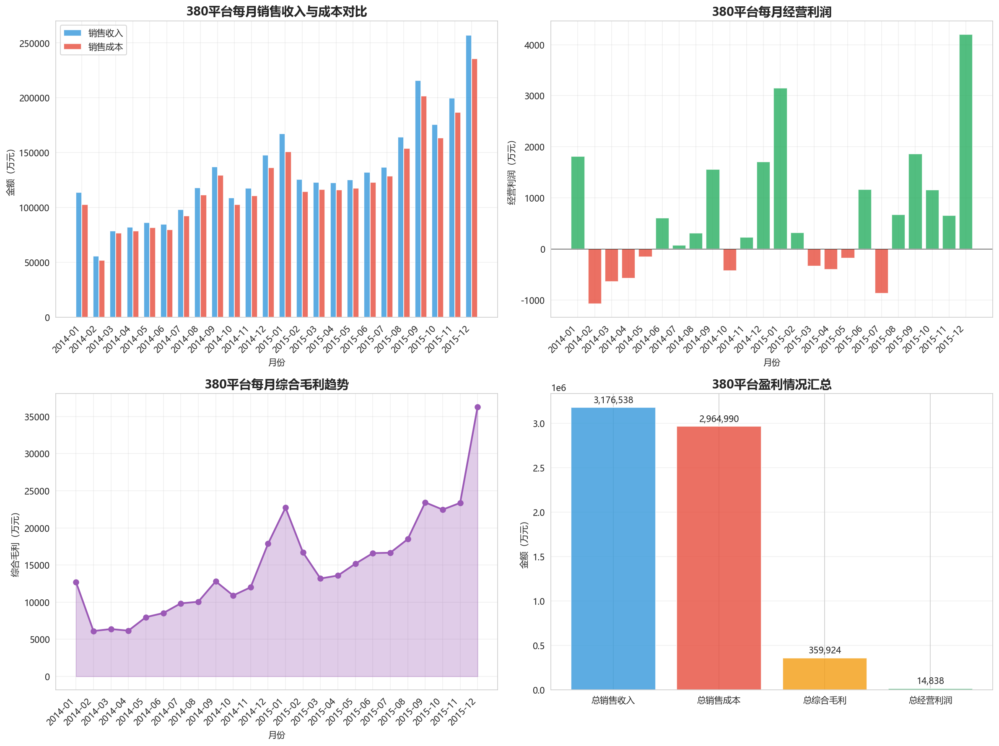
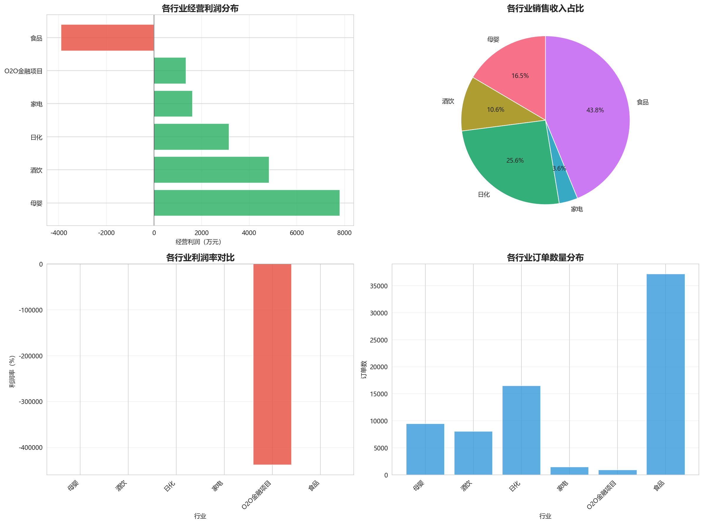
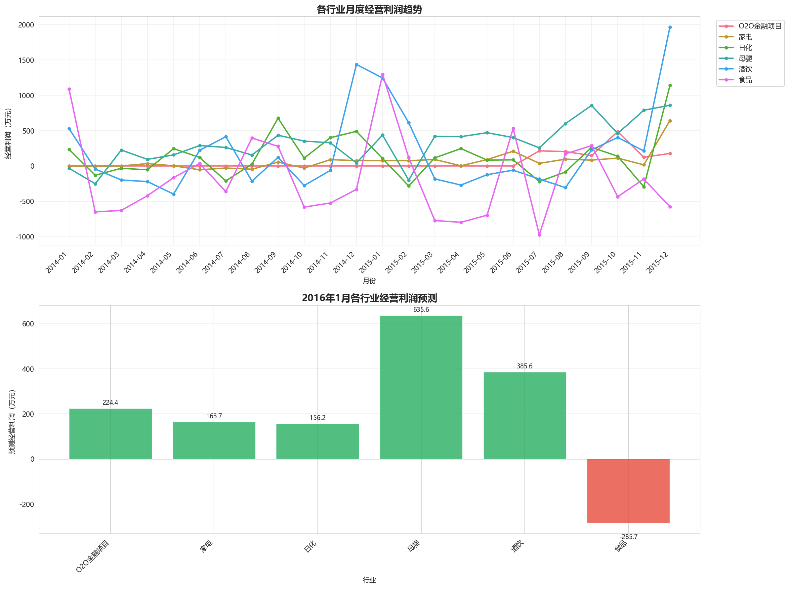
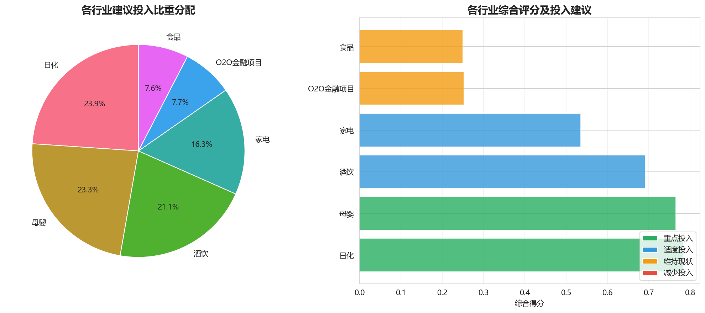
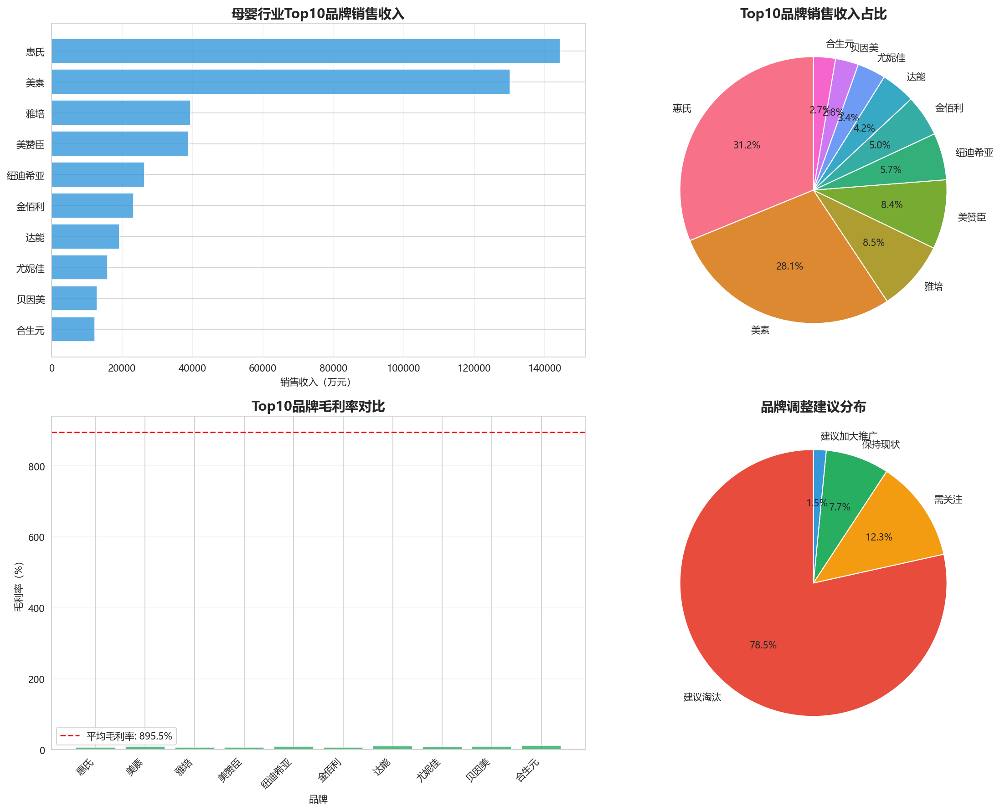
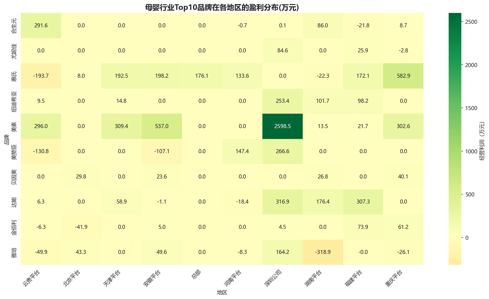
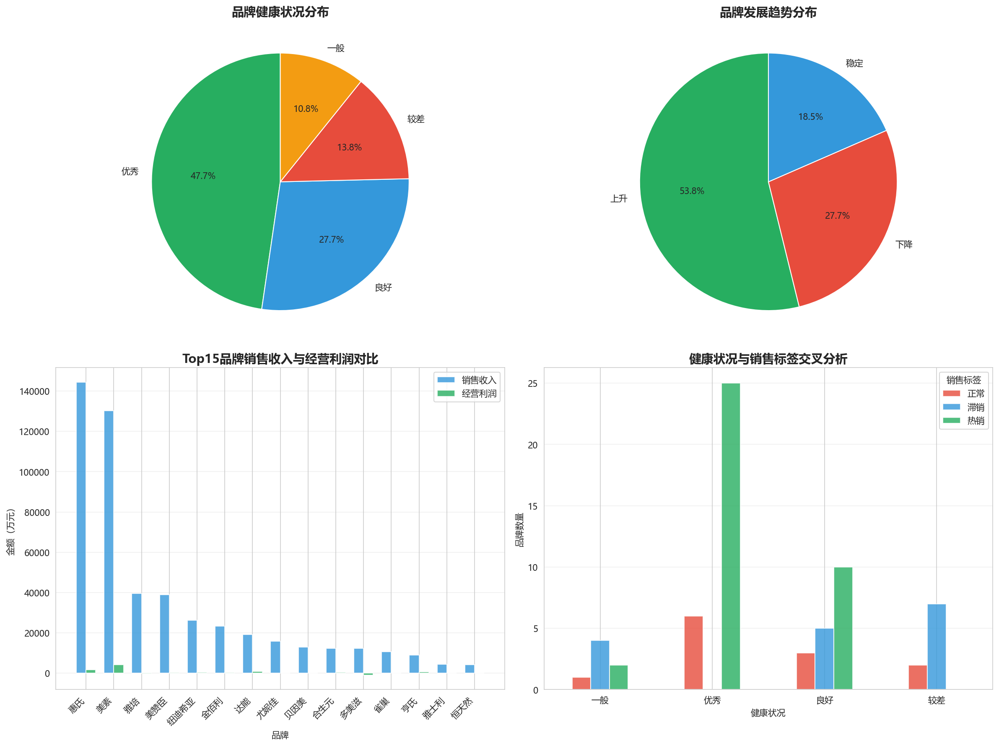

# 🏢 供应链经营数据分析

<p align="center">
  
  
  
  
  
</p>

<p align="center">
  <b>基于 Python 的电商平台供应链经营数据分析项目</b>
</p>

---

## 📋 目录

- [项目简介](#-项目简介)
- [项目背景](#-项目背景)
- [数据说明](#-数据说明)
- [项目任务](#-项目任务)
- [项目结构](#-项目结构)
- [技术栈](#️-技术栈)
- [快速开始](#-快速开始)
- [分析结果](#-分析结果)
- [可视化展示](#-可视化展示)
- [优化建议](#-优化建议)
- [许可证](#-许可证)

---

## 📖 项目简介

本项目是一个完整的电商平台供应链经营数据分析案例，通过对 **380平台** 2014-2015年的经营数据进行深度分析，从**运营情况**、**财务状况**、**物流管理**等多个维度评估平台及母婴部门的健康状况和发展趋势，为企业决策提供数据支撑。

项目综合运用了 Python 数据分析和数据可视化技术，主要使用 `pandas`、`matplotlib`、`seaborn` 等库进行数据处理和可视化分析。

## 🌐 项目背景

随着电子商务的迅速发展和网络购物的流行，电商企业面临着巨大的发展机遇和激烈的市场竞争。在这种背景下，除了提高商品质量、优化价格策略之外，**深入理解经营数据、洞察消费者需求**对电商企业来说变得尤为重要。

本项目模拟真实的企业数据分析场景：

> 假设你是 380 平台的副经理，主要负责母婴部门。根据平台经营数据，你需要完成年度总结报告，通过对运营情况、财务状况、物流管理等维度的分析，评估部门健康状况和发展趋势，指导平台发现问题并进行优化。

## 📊 数据说明

### 数据概览

| 项目 | 说明 |
|------|------|
| **数据来源** | 380平台经营数据 |
| **时间范围** | 2014年1月 - 2015年12月 |
| **数据规模** | 73,590 条记录 |
| **字段数量** | 36 个字段 |

### 主要字段

| 字段类别 | 包含字段 |
|---------|---------|
| **基础信息** | 结算编码、结算客户、省区平台、城市、项目部、行业、项目简称 |
| **时间信息** | 日期 |
| **销售指标** | 销售收入、销售成本、购销毛利、综合毛利 |
| **财务指标** | 经营利润、业务利润、管理费用、经营费用、市场费用、财务费用 |
| **库存指标** | 期末存货余额、预付账款期末数、应收账款期末余额 |
| **回款指标** | 回款指标、回款金额 |

### 数据处理

- **缺失值处理**：数值型字段用 0 填充，非数值型字段用"未知"填充
- **重复值处理**：检测并删除重复记录
- **时间转换**：将日期字段转换为标准日期格式，提取年、月信息

## 🎯 项目任务

### 任务3️⃣ 数据预处理

- [x] 理解各字段含义
- [x] 缺失值检测与处理
- [x] 重复值检测与处理
- [x] 数据类型转换
- [x] 数据清洗与导出

### 任务4️⃣ 平台行业分析

| 子任务 | 描述 | 输出 |
|--------|------|------|
| **4.1** | 统计分析380平台每月的盈利情况 | 月度盈利趋势图、数据表 |
| **4.2** | 统计分析380平台各行业的盈利分布情况 | 行业盈利分布图、利润率对比 |
| **4.3** | 统计分析各行业每月盈利情况并预测下月盈利 | 趋势预测图、预测数据 |
| **4.4** | 为各行业投入比重分配提供建议 | 投入建议报告、决策矩阵 |

### 任务5️⃣ 母婴行业分析

| 子任务 | 描述 | 输出 |
|--------|------|------|
| **5.1** | 统计分析母婴行业各品牌销售分布情况 | 品牌销售排名、调整建议 |
| **5.2** | 统计分析各品牌在各地区的盈利分布情况 | 地区盈利热力图 |
| **5.3** | 统计分析各品牌库存和周转情况 | 品牌标签表(热销/正常/滞销) |
| **5.4** | 综合分析母婴行业运营情况 | 健康状况评估、优化建议 |

## 📁 项目结构

```
Supply-chain-operation-data-analysis/
│
├── 📂 code/                              # Python 分析代码
│   ├── data_analysis.py                  # 数据预处理脚本
│   └── complete_analysis.py              # 完整分析脚本（包含所有任务）
│
├── 📂 data/                              # 数据文件
│   ├── 380平台－数据源.xlsx              # 原始数据文件
│   ├── 380平台(已处理).csv               # 预处理后的数据
│   ├── 数据列信息.csv                    # 数据字段说明
│   │
│   ├── 📊 任务4 输出文件
│   │   ├── 任务4.1(380平台月盈利).csv    # 每月盈利统计
│   │   ├── 任务4.2(各行业盈利分布).csv   # 行业盈利分布
│   │   ├── 任务4.3(各行业月盈利).csv     # 行业月度盈利
│   │   ├── 任务4.3(盈利预测).csv         # 盈利预测结果
│   │   └── 任务4.4(投入比重建议).csv     # 投入建议
│   │
│   └── 📊 任务5 输出文件
│       ├── 任务5.1(品牌销售分布).csv     # 品牌销售分布
│       ├── 任务5.2(品牌地区盈利).csv     # 品牌地区盈利
│       ├── 任务5.3(品牌库存周转).csv     # 库存周转数据
│       ├── 任务5.3(品牌标签表).csv       # 品牌标签(热销/正常/滞销)
│       ├── 任务5.4(综合分析).csv         # 综合分析结果
│       └── 任务5.4(需加大推广的品牌).csv # 推广建议
│
├── 📂 graph/                             # 可视化图表
│   ├── 4.1_平台月盈利分析.png            # 月度盈利分析图
│   ├── 4.2_各行业盈利分布.png            # 行业盈利分布图
│   ├── 4.3_各行业月盈利及预测.png        # 月度趋势与预测图
│   ├── 4.4_投入比重建议.png              # 投入建议图
│   ├── 5.1_品牌销售分布.png              # 品牌销售分布图
│   ├── 5.2_品牌地区盈利热力图.png        # 地区盈利热力图
│   ├── 5.3_库存周转分析.png              # 库存周转分析图
│   └── 5.4_综合分析.png                  # 综合分析图
│
├── 📂 paper/                             # 报告文件
│   └── report.html                       # 📄 交互式分析报告
│
├── Python供应链经营数据分析项目实训方案.pdf  # 项目任务书
│
└── README.md                             # 项目说明文档
```

## 🛠️ 技术栈

| 技术 | 用途 | 版本要求 |
|------|------|---------|
|  | 编程语言 | 3.8+ |
|  | 数据处理与分析 | 1.5+ |
|  | 数值计算 | 1.24+ |
|  | 数据可视化 | 3.7+ |
|  | 统计可视化 | 0.12+ |
|  | Excel文件处理 | 3.1+ |

## 🚀 快速开始

### 环境要求

- Python 3.8 或更高版本
- pip 包管理器

### 1️⃣ 克隆项目

```bash
git clone https://github.com/your-username/Supply-chain-operation-data-analysis.git
cd Supply-chain-operation-data-analysis
```

### 2️⃣ 安装依赖

```bash
pip install pandas numpy matplotlib seaborn openpyxl
```

### 3️⃣ 运行分析脚本

```bash
cd code
python complete_analysis.py
```

脚本将自动完成以下工作：
- 📥 读取原始数据
- 🔧 数据预处理
- 📊 生成分析图表
- 💾 保存分析结果

### 4️⃣ 查看分析报告

在浏览器中打开交互式分析报告：

```bash
# Windows
start paper/report.html

# macOS
open paper/report.html

# Linux
xdg-open paper/report.html
```

## 📈 分析结果

### 平台整体情况

| 指标 | 数值 |
|------|------|
| **总销售收入** | 52.4 亿元 |
| **总经营利润** | 7,801 万元 |
| **行业数量** | 10+ 个 |
| **核心盈利来源** | 母婴行业 |

### 母婴行业分析

| 指标 | 数值 | 占比 |
|------|------|------|
| **品牌总数** | 65 个 | 100% |
| **盈利品牌** | 36 个 | 55.4% |
| **亏损品牌** | 29 个 | 44.6% |

### 品牌健康状况评估

```
优秀 ████████████████████████░░░░░░░░  31个 (47.7%)
良好 ███████████████░░░░░░░░░░░░░░░░░  18个 (27.7%)
一般 ████░░░░░░░░░░░░░░░░░░░░░░░░░░░░   7个 (10.8%)
较差 █████░░░░░░░░░░░░░░░░░░░░░░░░░░░   9个 (13.8%)
```

### 品牌标签分布（库存周转）

| 标签 | 判断标准 | 品牌数量 | 占比 | 建议 |
|------|---------|---------|------|------|
| 🔥 **热销** | 周转天数 < 60天 | 37 | 56.9% | 增加备货 |
| ✅ **正常** | 周转天数 60-180天 | 12 | 18.5% | 保持现状 |
| ⚠️ **滞销** | 周转天数 > 180天 | 16 | 24.6% | 清理库存 |

### 发展趋势分析

| 趋势 | 品牌数量 | 占比 |
|------|---------|------|
| 📈 上升 | 35 | 53.8% |
| ➡️ 稳定 | 12 | 18.5% |
| 📉 下降 | 18 | 27.7% |

## 📊 可视化展示

### 平台行业分析

<table>
  <tr>
    <td align="center"><b>任务 4.1 月度盈利分析</b></td>
    <td align="center"><b>任务 4.2 行业盈利分布</b></td>
  </tr>
  <tr>
    <td></td>
    <td></td>
  </tr>
  <tr>
    <td align="center"><b>任务 4.3 趋势与预测</b></td>
    <td align="center"><b>任务 4.4 投入建议</b></td>
  </tr>
  <tr>
    <td></td>
    <td></td>
  </tr>
</table>

### 母婴行业分析

<table>
  <tr>
    <td align="center"><b>任务 5.1 品牌销售分布</b></td>
    <td align="center"><b>任务 5.2 地区盈利热力图</b></td>
  </tr>
  <tr>
    <td></td>
    <td></td>
  </tr>
  <tr>
    <td align="center"><b>任务 5.3 库存周转分析</b></td>
    <td align="center"><b>任务 5.4 综合分析</b></td>
  </tr>
  <tr>
    <td></td>
    <td></td>
  </tr>
</table>

## 💡 优化建议

### 1. 库存管理优化 📦

| 品牌类型 | 当前状况 | 优化措施 |
|---------|---------|---------|
| 滞销品牌 (16个) | 周转率低，资金占用 | 及时清理库存，降低积压 |
| 热销品牌 (37个) | 周转快，易缺货 | 增加安全库存，避免断货 |

### 2. 成本结构优化 💰

- **亏损品牌**（29个）：深入分析亏损原因，优化成本结构或考虑淘汰
- **低毛利品牌**：提升议价能力，优化采购成本

### 3. 品牌策略调整 🏷️

| 策略 | 适用品牌 | 具体措施 |
|------|---------|---------|
| **重点投入** | 惠氏、美素、雅培、美赞臣 | 保持资源倾斜，扩大市场份额 |
| **加大推广** | 高毛利低销量品牌 | 增加营销投入，提升知名度 |
| **评估淘汰** | 低毛利低销量品牌 | 分析存在价值，优化品牌结构 |

### 4. 区域策略 🗺️

- 根据地区盈利热力图，**针对亏损区域调整营销策略**
- 在盈利区域**加大投入**，扩大市场份额
- 分析区域差异原因，制定差异化运营方案

## 📝 总结

本项目通过对 380 平台供应链经营数据的全面分析，得出以下主要结论：

1. **整体健康**：母婴部门超过 75% 的品牌处于"优秀"或"良好"状态
2. **发展积极**：超过 50% 的品牌呈上升趋势
3. **问题明确**：16 个滞销品牌需清理库存，29 个亏损品牌需优化成本
4. **头部集中**：惠氏、美素等头部品牌贡献主要销售额和利润

**预计 2016 年发展趋势积极，建议平台继续加大对母婴行业的投入，特别是头部优质品牌。**

---

## 📄 许可证

本项目仅用于学习和研究目的。

## 🤝 贡献

欢迎提交 Issue 和 Pull Request！

---

<p align="center">
  <b>📊 数据驱动决策，洞察商业价值 📈</b>
</p>

<p align="center">
  Made with ❤️ using Python
</p>
